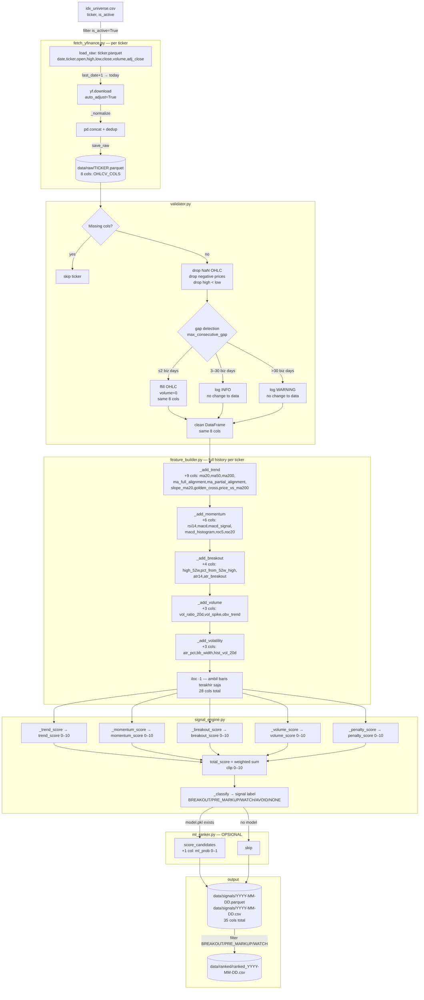

# Codebase Audit — idx-stock-scanner-agent

**Tanggal audit:** 2026-05-07  
**Auditor:** Self-audit (Claude Sonnet 4.6)  
**Scope:** `stock_scanner/pipeline/` end-to-end  
**Tone:** Jujur dan kritis. Kode ini dibuat untuk bootstrap cepat — bukan production-ready.

---

## A. Data Flow Diagram

### A.1 Pipeline Overview



### A.2 Column Lineage

| Stage | Kolom ditambah | Kolom dihapus |
|---|---|---|
| `fetch_yfinance` | `date, ticker, open, high, low, close, volume, adj_close` | — |
| `validator` | *(tidak ada kolom baru)* | baris NaN/negatif/high<low |
| `feature_builder` | `ma20, ma50, ma200, ma_full_alignment, ma_partial_alignment, slope_ma20, golden_cross, price_vs_ma200, rsi14, macd, macd_signal, macd_histogram, roc5, roc20, high_52w, pct_from_52w_high, atr14, atr_breakout, vol_ratio_20d, vol_spike, obv_trend, atr_pct, bb_width, hist_vol_20d` | `open, high, low, adj_close` *(tidak masuk FEATURE_COLS)* |
| `signal_engine` | `trend_score, momentum_score, breakout_score, volume_score, penalty_score, total_score, signal` | — |
| `ml_ranker` | `ml_prob` | — |
| `explain_agent` | `explanation` *(opsional)* | — |
| `_save_ranked` | *(filter rows only)* | semua row AVOID + NONE |

---

## B. Feature Inventory

Semua fitur dihitung di `feature_builder.py`. Kolom: **nama**, **formula**, **lookback period**, **forward-looking?**

### B.1 Trend Features

| Kolom | Formula | Lookback | Forward-looking? |
|---|---|---|---|
| `ma20` | `close.rolling(20).mean()` | 20 hari | ✅ Tidak |
| `ma50` | `close.rolling(50).mean()` | 50 hari | ✅ Tidak |
| `ma200` | `close.rolling(200).mean()` | 200 hari | ✅ Tidak |
| `ma_full_alignment` | `ma20 > ma50 AND ma50 > ma200` | 200 hari | ✅ Tidak |
| `ma_partial_alignment` | `ma20 > ma50` | 50 hari | ✅ Tidak |
| `slope_ma20` | `ma20 - ma20.shift(5)` | 25 hari | ✅ Tidak |
| `golden_cross` | `(ma50 > ma200) AND (ma50.shift(1) ≤ ma200.shift(1))` | 201 hari | ✅ Tidak |
| `price_vs_ma200` | `(close - ma200) / ma200 × 100` | 200 hari | ✅ Tidak |

### B.2 Momentum Features

| Kolom | Formula | Lookback | Forward-looking? |
|---|---|---|---|
| `rsi14` | `ta.RSIIndicator(close, 14)` — EMA-based | ~28 hari | ✅ Tidak |
| `macd` | `EMA(12) - EMA(26)` | ~52 hari | ✅ Tidak |
| `macd_signal` | `EMA(macd, 9)` | ~61 hari | ✅ Tidak |
| `macd_histogram` | `macd - macd_signal` | ~61 hari | ✅ Tidak |
| `roc5` | `(close / close.shift(5) - 1) × 100` | 5 hari | ✅ Tidak |
| `roc20` | `(close / close.shift(20) - 1) × 100` | 20 hari | ✅ Tidak |

### B.3 Breakout Features

| Kolom | Formula | Lookback | Forward-looking? |
|---|---|---|---|
| `high_52w` | `high.rolling(252, min_periods=50).max()` | 252 hari | ✅ Tidak |
| `pct_from_52w_high` | `(close - high_52w) / high_52w × 100` | 252 hari | ✅ Tidak |
| `atr14` | `ta.AverageTrueRange(high, low, close, 14)` | 14 hari | ✅ Tidak |
| `atr_breakout` | `close > close.shift(1) + 1.5 × atr14.shift(1)` | 15 hari | ✅ Tidak |

### B.4 Volume Features

| Kolom | Formula | Lookback | Forward-looking? |
|---|---|---|---|
| `vol_ratio_20d` | `volume / volume.rolling(20).mean()` | 20 hari | ✅ Tidak |
| `vol_spike` | `vol_ratio_20d > 2.5` | 20 hari | ✅ Tidak |
| `obv_trend` | `OBV > OBV.shift(10)` | 10 hari | ✅ Tidak |

### B.5 Volatility Features

| Kolom | Formula | Lookback | Forward-looking? |
|---|---|---|---|
| `atr_pct` | `atr14 / close × 100` | 14 hari | ✅ Tidak |
| `bb_width` | `(BB_upper - BB_lower) / BB_mid × 100`, window=20, std=2 | 20 hari | ✅ Tidak |
| `hist_vol_20d` | `log_return.rolling(20).std() × √252 × 100` | 20 hari | ✅ Tidak |

**Kesimpulan fitur:** Tidak ada forward-looking feature di level *per-baris*. Semua rolling window hanya menggunakan data masa lalu pada baris yang bersangkutan.

---

## C. Label Leakage Audit

### C.1 Cara Target Label Dibuat

```python
# ml_ranker.py:89-91
df["_future_close"] = df.groupby("ticker")["close"].shift(-horizon)
df["_return_fwd"] = (df["_future_close"] - df["close"]) / df["close"] × 100
df["_target"] = (df["_return_fwd"] > target_pct).astype(int)
```

- **Default:** `horizon=5` hari ke depan, `target_pct=3.0%`
- Target dibuat dengan benar: menggunakan `shift(-5)`, yaitu close hari ke-T+5
- Baris 5 hari terakhir per ticker di-drop karena tidak punya future close

### C.2 Feature yang Berisiko Bocor Info Masa Depan

**Tidak ada feature yang secara langsung forward-looking** pada level baris. Namun ada tiga risiko struktural:

| Risiko | Lokasi | Tingkat keparahan |
|---|---|---|
| **Circular features** | `train_ranker` menggunakan `trend_score`, `momentum_score`, dst. sebagai ML feature. Skor ini adalah output rule engine yang dirancang untuk memprediksi return — bukan raw data. Model belajar dari sinyal yang sudah "pre-digested". | 🟡 Medium — bukan leakage tapi circular dependency yang mengaburkan attribution |
| **No train/test split** | `model.fit(X, y)` dipanggil pada SELURUH dataset tanpa pemisahan. Train/test split yang ada di komentar (`shuffle=False`) tidak pernah aktif. | 🔴 Kritis |
| **Temporal contamination jika random split dipakai** | Kode berisi komentar `train_test_split` tanpa `shuffle=False` secara aktif. Jika diaktifkan dengan `shuffle=True` (default sklearn), data masa depan bocor ke training set | 🔴 Kritis jika dipakai |

### C.3 Apakah Train/Test Split Mempertimbangkan Time Series Order?

**Tidak.** Kode aktif saat ini:

```python
# ml_ranker.py:114-115
model = _BaseModel(n_estimators=200, max_depth=4, learning_rate=0.05, random_state=42)
model.fit(X, y)  # seluruh dataset, tidak ada split sama sekali
```

Train/test split ada di komentar dan tidak pernah dieksekusi. Ini berarti:
1. Tidak ada evaluasi model yang valid
2. Model berpotensi memorize seluruh dataset (overfitting 100%)
3. `ml_prob` yang dihasilkan tidak mencerminkan out-of-sample performance

**Yang seharusnya:** `sklearn.model_selection.TimeSeriesSplit` atau walk-forward validation.

### C.4 Feature yang Di-compute Pakai Data Sebelum DAN Sesudah Baris Saat Ini

Tidak ada contoh klasik look-ahead bias per-baris. Namun ada satu kasus tidak langsung:

**`high_52w`** menggunakan `rolling(252, min_periods=50).max()` pada kolom `high`. Ini aman — rolling max hanya melihat ke belakang. Namun **jika fitur ini digunakan dalam ML training tanpa memastikan urutan temporal**, dan training data dikumpulkan dengan cara yang meng-include data lebih baru dari titik prediksi, ada risiko kontaminasi.

**Praktisnya:** Tidak ada look-ahead per baris. Risiko utama adalah tidak adanya walk-forward validation.

---

## D. Hardcoded Magic Numbers

Semua threshold di `signal_engine.py` dianalisis di bawah. Kolom **Justifikasi** menilai apakah ada alasan yang didokumentasikan.

### D.1 Score Weights (dalam `_trend_score`, `_momentum_score`, dll.)

| Magic Number | Lokasi | Konteks | Justifikasi |
|---|---|---|---|
| `× 10` | `_trend_score` | `ma_full_alignment` → 10 poin | ❌ Tidak ada. Angka dipilih agar langsung maxout clip(0,10) |
| `× 5` | `_trend_score` | `ma_partial_alignment` → 5 poin | ❌ Tidak ada. **Dead code** — lihat bug #1 di bawah |
| `× 2` | `_trend_score` | `slope_ma20 > 0` → 2 poin | ❌ Tidak ada |
| `× 3` | `_trend_score` | `golden_cross` → 3 poin | ❌ Tidak ada |
| `rsi >= 40 AND rsi <= 70` | `_momentum_score` | "ideal RSI range" | ⚠️ Konvensi umum analisis teknikal tapi tidak dikutip sumber |
| `× 5` | `_momentum_score` | RSI ideal → 5 poin | ❌ Tidak ada |
| `× 3` | `_momentum_score` | `macd_histogram > 0` → 3 poin | ❌ Tidak ada |
| `× 1` | `_momentum_score` | `roc5 > 0`, `roc20 > 0` | ❌ Tidak ada |
| `pct_from_52w_high >= -5` | `_breakout_score` | "strong breakout setup" | ❌ Tidak ada. Mengapa -5%? Bukan -3% atau -7%? |
| `pct_from_52w_high >= -15` | `_breakout_score` | "approaching" | ❌ Tidak ada |
| `× 5` | `_breakout_score` | `pct >= -5` → 5 poin, `atr_breakout` → 5 poin | ❌ Tidak ada |
| `× 2` | `_breakout_score` | `pct >= -15` → 2 poin | ❌ Tidak ada |
| `vol_ratio_20d >= 2.0` | `_volume_score` | "strong volume surge" | ❌ Tidak ada. Mengapa 2.0x? |
| `vol_ratio_20d >= 1.3` | `_volume_score` | "moderate" | ❌ Tidak ada |
| `× 5` | `_volume_score` | strong surge → 5 poin, `obv_trend` → 5 poin | ❌ Tidak ada |
| `× 3` | `_volume_score` | moderate volume → 3 poin | ❌ Tidak ada |
| `rsi > 80` | `_penalty_score` | "overbought ekstrem" | ⚠️ Konvensi umum (biasanya RSI > 70 = overbought), 80 lebih konservatif. Tidak dikutip |
| `× 8` | `_penalty_score` | RSI > 80 → penalty 8 poin | ❌ Tidak ada. Mengapa 8, bukan 10? |
| `volume < 100_000` | `_penalty_score` | "volume sangat rendah" | 🔴 **BUG** — lihat bug #2 di bawah |
| `× 5` | `_penalty_score` | low volume → 5 poin | ❌ Tidak ada |
| `vol_ratio_20d > 2.5` | `feature_builder._add_volume` | `vol_spike` threshold | ❌ Tidak ada (berbeda dari 2.0x di signal engine — inkonsisten) |
| `min_periods=50` | `feature_builder._add_breakout` | `high_52w` rolling | ❌ Tidak ada. Mengapa 50 bukan 126 (6 bulan)? |
| `1.5 × atr14` | `feature_builder._add_breakout` | `atr_breakout` | ⚠️ Referensi umum teknikal tapi tidak dikutip |

### D.2 Classification Thresholds

| Threshold | Lokasi | Justifikasi |
|---|---|---|
| `total_score >= 7.5` untuk BREAKOUT | `_DEFAULTS` / `scanner_config.yaml` | ❌ Arbitrer. Perlu backtest untuk tahu apakah 7.5 memiliki precision/recall yang baik |
| `breakout_score >= 7.0` | idem | ❌ Arbitrer |
| `volume_score >= 6.0` | idem | ❌ Arbitrer |
| `total_score >= 5.5` untuk PRE_MARKUP | idem | ❌ Arbitrer |
| `trend_score >= 5.0` untuk PRE_MARKUP | idem | ❌ Arbitrer |
| `total_score >= 3.5` untuk WATCH | idem | ❌ Arbitrer |
| `total_score < 2.0` → AVOID | `_classify` hardcoded | ❌ Tidak ada di config, hardcoded di Python |
| `penalty_score >= 8` → hard AVOID | `_classify` | ❌ Tidak ada di config, hardcoded |

### D.3 Scoring Weight

```python
total_score = trend*0.25 + momentum*0.25 + breakout*0.25 + volume*0.15 - penalty*0.10
```

**Masalah:** Weights hanya dijumlahkan ke 0.90, bukan 1.0. Nilai `total_score` maksimum yang bisa dicapai (dengan semua komponen = 10, penalty = 0) adalah **9.0**, bukan 10. Komentar "0–10 scale" menyesatkan. Threshold BREAKOUT 7.5 sebenarnya setara 83% dari nilai maksimum yang bisa dicapai.

---

## E. Test Coverage

**NONE.**

Folder `tests/` tidak ada. Tidak ada satu pun unit test yang ditulis.

Implikasi:
- Tidak ada perlindungan terhadap regresi ketika refactor
- Tidak ada validasi bahwa `_max_consecutive_gap()` menghitung dengan benar
- Tidak ada test bahwa `build_features()` idempoten (output sama jika dipanggil dua kali)
- Tidak ada test bahwa `compute_signal()` tidak crash jika ada kolom yang hilang
- Tidak ada test bahwa `incremental_update()` tidak duplikat baris
- Seluruh pipeline ditest secara manual dengan data live — sangat rapuh

---

## F. External Dependencies Risk

Semua asumsi ini tentang format data yfinance yang bisa berubah tanpa peringatan:

| Asumsi | Lokasi | Risiko |
|---|---|---|
| Column name: `"Adj Close"` → lowercase `"adj close"` | `fetch_yfinance._normalize` | 🟡 yfinance sudah beberapa kali mengubah kapitalisasi kolom antar versi. Kode ada `rename({"adj close": "adj_close"})` tapi jika nama berubah ke `"Adj_Close"` atau hilang → silently `adj_close = close` |
| Batch download return MultiIndex `raw[ticker]` | `_extract_ticker` | 🔴 Paling sering berubah. yfinance ≥0.2.18 mengubah behavior MultiIndex untuk batch. Kode ada guard tapi tidak tested edge case satu ticker dalam batch |
| `group_by="ticker"` di `yf.download` | `fetch_yfinance.fetch` | 🔴 Parameter ini dihapus di beberapa versi beta yfinance. Jika dihapus, batch download struktur berubah total |
| `auto_adjust=True` menghapus kolom `Adj Close` terpisah | `_normalize` | 🟡 Dengan `auto_adjust=True`, harga sudah adjusted di kolom `Close`. Tapi kode masih membuat `adj_close = close` sebagai fallback — nilai bisa salah jika behavior berubah |
| Date index dari yfinance sudah timezone-aware | `_normalize` | 🟡 Kode melakukan `dt.tz_localize(None)` — jika yfinance sudah mengembalikan tz-naive, ini silently no-op (OK). Tapi jika timezone berubah format, konversi bisa salah |
| Ticker format `.JK` untuk IDX | `idx_universe.csv` | 🟡 Yahoo Finance bisa mengubah suffix IDX kapan saja. Tidak ada validasi bahwa `.JK` tickers benar-benar exist sebelum download |
| yfinance tidak rate-limit atau ban IP | `fetch_yfinance` | 🔴 Tidak ada retry logic, exponential backoff, atau handling 429/403. Untuk universe besar, kemungkinan kena rate limit tinggi |
| Data tersedia untuk seluruh `lookback_years=3` | `incremental_update` | 🟡 Saham IPO < 3 tahun akan memberikan data lebih sedikit tapi tidak di-flag. Feature seperti `ma200` akan return NaN untuk semua baris |

---

## G. Critical Issues

Top 5 masalah yang **harus** diperbaiki sebelum output pipeline ini bisa digunakan untuk decision making nyata:

---

### 🔴 #1 — Dead Code di `_trend_score`: `ma_partial_alignment` Tidak Pernah Dipilih

**Lokasi:** `signal_engine.py:104–107`

```python
if "ma_full_alignment" in df.columns:       # selalu True setelah feature_builder
    score += df["ma_full_alignment"] * 10
elif "ma_partial_alignment" in df.columns:  # TIDAK PERNAH DIEKSEKUSI
    score += df["ma_partial_alignment"] * 5
```

`feature_builder` selalu membuat kedua kolom. Kondisi `elif` tidak pernah jalan. Akibatnya:
- Saham yang **MA20 > MA50 tapi MA50 < MA200** (partial bullish, belum full) mendapat score dari `ma_full_alignment=False → 0` ditambah max dari slope (2) dan golden_cross (3) = **5 poin**.
- Saham yang **tidak ada MA sama sekali** (terlalu sedikit data) juga mendapat **5 poin** dari route yang sama.
- Kedua kasus tidak dapat dibedakan. Skor partial alignment yang dimaksud (5 poin) tidak pernah diberikan.

---

### 🔴 #2 — Bug Unit Volume di `_penalty_score`: Share Count vs IDR Value

**Lokasi:** `signal_engine.py:161`

```python
# Komentar: "< 100 juta IDR (perkiraan konservatif)"
penalty += (df["volume"].fillna(0) < 100_000).astype(float) * 5
```

Kolom `volume` berisi **jumlah lot/lembar saham**, bukan IDR. Untuk saham Rp 2.000 per lembar, 100.000 lembar = Rp 200 juta — dua kali lipat dari yang dimaksud komentar. Untuk saham Rp 50 (penny stock), 100.000 lembar = Rp 5 juta. Threshold tunggal 100.000 tidak bermakna di semua harga.

**Cara benar:** Gunakan `volume × close` untuk menghitung nilai transaksi dalam IDR, lalu bandingkan dengan threshold IDR yang eksplisit.

---

### 🔴 #3 — ML Model Tidak Punya Evaluasi: Angka `ml_prob` Tidak Dapat Dipercaya

**Lokasi:** `ml_ranker.py:114–115`

Model dilatih pada **seluruh dataset tanpa train/test split**:
```python
model.fit(X, y)  # tidak ada split, tidak ada validation
```

Ini berarti `ml_prob` yang muncul di output bukan out-of-sample probability — ini adalah *training score* yang overfit. Pengguna yang melihat `ml_prob=0.87` tidak tahu apakah itu sinyal nyata atau model memorizing data lama.

**Minimum yang harus ada sebelum ditampilkan ke user:**
1. `TimeSeriesSplit` walk-forward validation
2. Laporan precision/recall/AUC pada test set
3. Timestamp model training agar tahu kapan terakhir retrain

Sampai ini ada, kolom `ml_prob` **sebaiknya tidak ditampilkan di dashboard** sebagai "probabilitas" — label-nya menyesatkan.

---

### 🔴 #4 — Tidak Ada Script Training ML: Model Tidak Bisa Dibuat

**Lokasi:** `run_daily_scan.py:103` dan seluruh `ml_ranker.py`

Fungsi `train_ranker()` ada, tapi tidak ada script/entrypoint untuk memanggilnya. Scan harian hanya mencoba `load_ranker(model_path)` — jika model tidak ada, silently skip. Tidak ada cara untuk membuat `models/ranker.pkl` pertama kali kecuali menulis kode sendiri.

**Efek:** Fitur ML sama sekali tidak fungsional end-to-end. Ini bukan "opsional" — ini broken.

---

### 🟡 #5 — Semua Threshold di Signal Engine Belum Divalidasi dengan Backtest

**Lokasi:** `signal_engine.py` keseluruhan

28+ magic numbers menentukan siapa yang masuk BREAKOUT, PRE_MARKUP, WATCH, atau AVOID — tidak satupun dikalibrasi terhadap data historis IDX. Ini berarti:

- Kita tidak tahu apakah sinyal `BREAKOUT` memiliki forward return yang lebih baik dari random
- Weight scoring (trend 25%, momentum 25%, dll.) dipilih secara intuitif, bukan berbasis backtested edge
- Classification cutoffs (7.5 / 5.5 / 3.5) arbitrer

**Sebelum pipeline ini dipakai untuk decision making nyata**, diperlukan minimal:
1. Simpan SEMUA sinyal historis (bukan hanya WATCH ke atas)
2. Track forward return (3d, 5d, 10d) per sinyal
3. Hitung hit rate per signal class dan per score bucket
4. Kalibrasi threshold berdasarkan data aktual IDX

---

## Ringkasan Keparahan

| Issue | File | Severity | Impact |
|---|---|---|---|
| `ma_partial_alignment` dead code | `signal_engine.py:106` | 🔴 Bug | Score salah untuk 20-40% ticker |
| Volume unit salah (share vs IDR) | `signal_engine.py:161` | 🔴 Bug | Penalty threshold tidak valid |
| ML tanpa evaluasi | `ml_ranker.py:115` | 🔴 Misleading | `ml_prob` tidak dapat dipercaya |
| Tidak ada training script | `ml_ranker.py` | 🔴 Broken feature | ML tidak bisa digunakan sama sekali |
| No test coverage | — | 🔴 Structural | Regresi tidak terdeteksi |
| Semua threshold tidak dikalibrasi | `signal_engine.py` | 🟡 Validation | Output belum proven |
| yfinance batch API fragility | `fetch_yfinance.py` | 🟡 Reliability | Bisa pecah tanpa warning saat update |
| Scoring weight tidak sum to 1.0 | `signal_engine.py:62-68` | 🟡 Math | Max score 9.0, bukan 10.0 |
| `ts < 2.0 → AVOID` hardcoded | `signal_engine.py:190` | 🟡 Config | Tidak ada di YAML, tidak bisa di-tune |
| No retry/backoff di fetch | `fetch_yfinance.py` | 🟡 Reliability | Rate limit crash untuk universe besar |
| Tidak ada model versioning | `ml_ranker.py` | 🟡 Ops | Tidak tahu kapan model terakhir dilatih |
