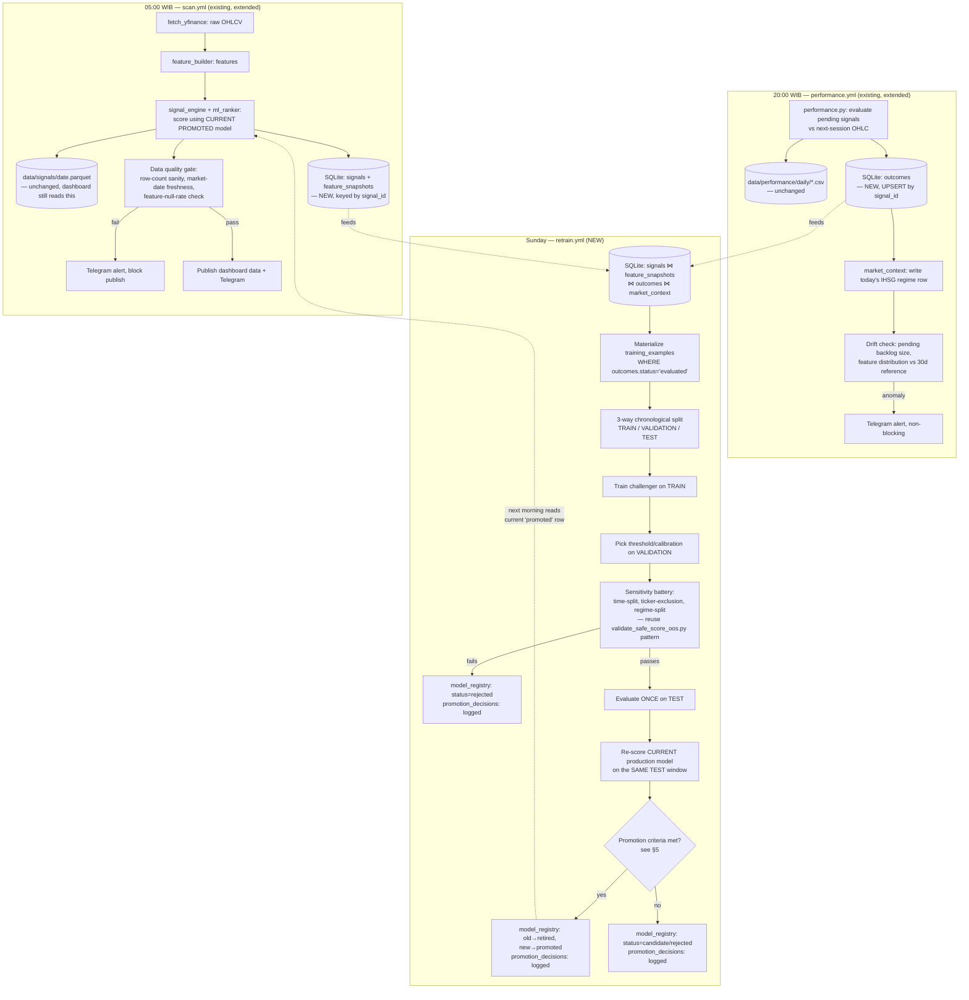

# Self-Improving Signal System — Architecture

**Status:** design doc, not yet implemented. Grounded in what actually exists in this repo today
(see §0) — not a generic ML-ops template.

**Related:** `data/reports/signal_diagnosis_report.md`, `signal_diagnosis_audit_leakage_overfitting.md`,
`signal_diagnosis_validation_oos.md` (gitignored, local) — the empirical work that motivated this
design. Read those first if you want the "why" behind specific choices below (walk-forward-only
validation, why RSI is excluded, why `squeeze_on` gets fast-tracked, etc).

---

## 0. What Already Exists (don't rebuild this)

| Piece | File | Status |
|---|---|---|
| Feature computation | `feature_builder.py` | ✅ Verified leak-free this session (empirical reconstruction match). Keep as-is. |
| Rule-based scoring | `signal_engine.py` (`total_score`) | ⚠️ Weak (correlation with `pct_close>10%` ≈ 0.02-0.19 depending on window). Component weights don't match each component's actual predictive power. |
| ML ranker | `ml_ranker.py` + `train_ranker_from_history.py` | ⚠️ Exists, but trains on a **different label** (forward 5-day return >3%, computed from ALL historical days for ALL tickers) than what the live signal stream actually measures (next-session `pct_close` vs signal-day close). AUC=0.594, recall=2.8% — barely useful. **Last trained 2026-05-21, never retrained since, no schedule.** |
| Outcome tracking | `performance.py` | ✅ Solid mechanism (signal_date → next-session eval, pending/evaluated states). This is the labeling engine — keep it, wire a DB mirror around it. |
| Feature snapshot | `data/signals/{date}.parquet` | ✅ This already IS a daily feature snapshot. Don't replace it — mirror it into SQL. |
| Orchestration | GitHub Actions (`scan.yml` 05:00 WIB, `performance.yml` 20:00 WIB) | ✅ Keep. No server, no Airflow needed at this scale. |
| Database | **None** — pure CSV/parquet, joined ad hoc by `(ticker, date)` string keys | ❌ This is the actual gap. The leakage audit found real bugs caused by exactly this (zero-volume date mismatches, snapshot-file misalignment) — a proper key-based join layer fixes a whole bug class, not just enables ML. |

**The core architectural problem to fix:** the ML ranker and the live signal stream are two
disconnected systems today. The ranker doesn't learn from what the screener actually fires on, and
the screener's `total_score` doesn't learn from outcomes at all. Closing that loop is the actual ask.

---

## 1. End-to-End Architecture



**Key principle:** promotion is a **metadata flip** in `model_registry`, not a code deploy. The
morning scan always asks "which model is currently `status='promoted'`?" — rollback is a one-row
`UPDATE`, not a redeploy.

---

## 2. Database Design

**Choice: SQLite**, not Postgres/cloud DB. Reasoning, specific to this repo: no server today, no
concurrent writers (one GitHub Actions job at a time), data volume is small (~1,000 tickers,
~1 scan/day, ~150 evaluated outcomes/day), and `pandas.read_sql`/`to_sql` work natively. SQLite gives
proper keys/joins/indexes — which is what's actually missing — without adding infrastructure to
operate. Revisit only if multiple writers or remote access become a real requirement.

File: `data/db/signals.db` (gitignored, like `data/raw/` — it's a derived artifact, rebuildable from
the same source files that already exist; don't commit a binary DB to git).

### 2.1 Core tables

```sql
-- One row per (ticker, signal_date, strategy) signal-emission event.
CREATE TABLE signals (
    signal_id        TEXT PRIMARY KEY,   -- sha1(ticker || signal_date || strategy)
    ticker           TEXT NOT NULL,
    signal_date      DATE NOT NULL,
    strategy         TEXT NOT NULL,       -- 'swing' | 'scalping'
    signal_label     TEXT NOT NULL,       -- 'BREAKOUT' | 'PRE_MARKUP' | 'SCALPING_HIGH'
    total_score      REAL,
    ml_prob          REAL,
    model_version_id TEXT,                -- FK -> model_registry: which model scored this AT SIGNAL TIME
    scan_run_id      TEXT,                -- GitHub Actions run id, for traceability
    created_at       TIMESTAMP DEFAULT CURRENT_TIMESTAMP,
    UNIQUE(ticker, signal_date, strategy)
);
CREATE INDEX idx_signals_date   ON signals(signal_date);
CREATE INDEX idx_signals_ticker ON signals(ticker);

-- Pre-signal feature vector AS OF signal_date close. Separate table so the
-- feature schema (FEATURE_COLS in feature_builder.py) can evolve without
-- ALTER TABLE churn on the core signals table.
CREATE TABLE feature_snapshots (
    signal_id            TEXT PRIMARY KEY REFERENCES signals(signal_id),
    feature_set_version  TEXT NOT NULL,    -- e.g. 'fb_v1' — tags which FEATURE_COLS schema was active
    features_json        TEXT NOT NULL,    -- {"rsi14": 48.9, "atr_breakout": false, ...}
    raw_close            REAL,             -- signal_date close == the "prev" reference price
    raw_open              REAL,
    raw_volume            REAL,
    snapshot_source_path TEXT              -- e.g. 'data/signals/2026-06-19.parquet' — audit trail
);

-- Realized outcome, filled in by performance.py's evening run.
CREATE TABLE outcomes (
    signal_id      TEXT PRIMARY KEY REFERENCES signals(signal_id),
    eval_date      DATE,
    status         TEXT NOT NULL DEFAULT 'pending',  -- 'pending' | 'evaluated' | 'invalid'
    prev_close     REAL,
    eval_open      REAL,
    eval_high      REAL,
    eval_close     REAL,
    pct_high       REAL,
    pct_close      REAL,
    wl             TEXT,             -- 'W' | 'L'
    label_success  INTEGER,          -- 1 if pct_close > label_threshold_pct, else 0; NULL while pending
    labeled_at     TIMESTAMP
);
CREATE INDEX idx_outcomes_status    ON outcomes(status);
CREATE INDEX idx_outcomes_eval_date ON outcomes(eval_date);

-- One row per calendar date — market regime context, joined by date at
-- training/serving time (not per-signal, since it's the same for every
-- ticker on a given day).
CREATE TABLE market_context (
    context_date    DATE PRIMARY KEY,
    ihsg_close      REAL,
    ihsg_pct_change REAL,
    ihsg_trend_5d   REAL,
    ihsg_trend_20d  REAL,
    regime_label    TEXT           -- 'risk_on' | 'risk_off' | 'neutral' — simple rule for now
);

-- Static reference (mirrors issuers.csv). Not "context that changes daily" —
-- a lookup table, refreshed manually when issuers.csv is edited.
CREATE TABLE sector_reference (
    ticker       TEXT PRIMARY KEY,
    company_name TEXT,
    sector       TEXT
);

-- Broker context — schema ready for when data/broker/ coverage improves.
-- Currently 62 tickers / sparse dates (verified in the leakage audit) —
-- DO NOT use this for training features yet; table exists so the pipeline
-- doesn't need a schema change once broker data coverage is fixed.
CREATE TABLE broker_context (
    ticker        TEXT NOT NULL,
    context_date  DATE NOT NULL,
    net_lot_top10 REAL,
    PRIMARY KEY (ticker, context_date)
);
```

### 2.2 Model lifecycle tables

```sql
-- Every trained model — challenger AND production, XGBoost ranker AND simple
-- rule-scores (so 'safe_score' itself is a registrable, versioned model_type
-- too, not just the XGBoost ranker).
CREATE TABLE model_registry (
    model_version_id    TEXT PRIMARY KEY,    -- e.g. 'ranker_v3_2026-07-06'
    model_type          TEXT NOT NULL,        -- 'xgboost_ranker' | 'rule_score'
    feature_list_json   TEXT NOT NULL,
    train_start_date    DATE,
    train_end_date      DATE,
    val_start_date      DATE,
    val_end_date        DATE,
    test_start_date     DATE,
    test_end_date       DATE,
    label_threshold_pct REAL,                 -- e.g. 10.0
    label_horizon       TEXT,                  -- 'next_session' (matches performance.py convention)
    train_metrics_json  TEXT,
    val_metrics_json    TEXT,
    test_metrics_json   TEXT,                  -- precision/recall/lift, see §4
    sensitivity_json    TEXT,                  -- ticker-exclusion / regime-split / threshold-perturbation results
    artifact_path       TEXT,                  -- e.g. 'models/ranker_v3.pkl', NULL for rule_score types
    status              TEXT NOT NULL DEFAULT 'candidate',  -- 'candidate'|'promoted'|'retired'|'rejected'
    promoted_at         TIMESTAMP,
    retired_at          TIMESTAMP,
    trained_at          TIMESTAMP DEFAULT CURRENT_TIMESTAMP
);
-- Invariant enforced by application code (SQLite has no partial-unique-index
-- across NULL easily, so check in the promotion script): at most ONE row per
-- model_type with status='promoted' at any time.

-- Every promotion EVALUATION, including rejections — this is the audit trail
-- the user explicitly wants (traceability of why a challenger was/wasn't promoted).
CREATE TABLE promotion_decisions (
    decision_id             INTEGER PRIMARY KEY AUTOINCREMENT,
    challenger_model_id     TEXT REFERENCES model_registry(model_version_id),
    production_model_id     TEXT REFERENCES model_registry(model_version_id),
    decision                TEXT NOT NULL,   -- 'promoted' | 'rejected' | 'needs_more_data'
    challenger_metrics_json TEXT,
    production_metrics_json TEXT,
    reason                  TEXT,
    decided_at              TIMESTAMP DEFAULT CURRENT_TIMESTAMP
);

-- Rolling live-performance monitor for the CURRENTLY promoted model — this is
-- what drift detection and rollback triggers read from.
CREATE TABLE live_monitoring (
    monitor_date                    DATE PRIMARY KEY,
    production_model_id             TEXT REFERENCES model_registry(model_version_id),
    n_signals                       INTEGER,
    n_evaluated                     INTEGER,
    realized_win_rate               REAL,
    realized_precision_at_threshold REAL,
    avg_predicted_prob              REAL,   -- for calibration-drift check (predicted vs realized gap)
    feature_drift_flag              INTEGER,
    alert_triggered                 INTEGER
);
```

### 2.3 Why `features_json` instead of one column per feature

`feature_builder.FEATURE_COLS` already has 40+ entries and grows whenever a new indicator is added.
A wide table means an `ALTER TABLE` (and a backfill decision for old rows) every time. A JSON blob
column avoids that churn; SQLite's `json_extract()` supports ad hoc querying, and the training script
expands it into a DataFrame at read time (`pd.json_normalize`) — same shape as today's
`data/signals/{date}.parquet`, just keyed properly.

---

## 3. Daily Workflow

### Morning (extends `scan.yml`, ~05:00 WIB)

1. Fetch OHLCV, build features, score with **the currently-promoted model** (registry lookup by
   `model_type` + `status='promoted'` — not a hardcoded `models/ranker.pkl` path).
2. Write `data/signals/{date}.parquet` as today (dashboard keeps reading this — no breaking change).
3. **NEW:** insert rows into `signals` + `feature_snapshots`, keyed by `signal_id`. Idempotent
   (`INSERT OR IGNORE` on the unique constraint) — safe to re-run the workflow without duplicating.
4. **NEW — data quality gate, blocking:**
   - Row count for today within `[0.5x, 2x]` of the trailing-10-day median (catches partial fetch
     failures).
   - Feature null-rate per column < 20% (catches a broken indicator computation).
   - Market-date freshness check (the exact bug class fixed earlier this session —
     `expected_market_date()` vs actual `scan_date` mismatch) — **block publish** if this fails, don't
     silently ship stale data.
5. Publish dashboard data + Telegram (existing) only if step 4 passes.

### Evening (extends `performance.yml`, ~20:00 WIB)

1. Evaluate pending signals vs next-session OHLC (existing `performance.py` logic, unchanged).
2. **NEW:** UPSERT into `outcomes` by `signal_id` — `status`, `pct_high`, `pct_close`, `wl`, and
   `label_success = (pct_close > label_threshold_pct)` using the threshold recorded on the
   currently-promoted model (so the label definition is explicit and versioned, not a magic constant
   buried in a script).
3. **NEW:** write today's `market_context` row (IHSG close/return/5d-trend/20d-trend, regime label —
   reuse `dashboard/data_loader.py::get_ihsg_session` logic, already built and tested this session).
4. **NEW — drift checks, non-blocking (alert only):**
   - Pending backlog size (rows stuck in `status='pending'` for >5 trading days — usually a delisted
     or suspended ticker, should be marked `'invalid'`, not silently left pending forever).
   - Feature-distribution check: compare today's `rsi14`/`vol_ratio_20d`/`atr_pct` percentiles against
     a trailing 30-day reference window (simple percentile-shift check, not a full PSI implementation
     — start simple).
   - Calibration check: rolling realized win rate vs the promoted model's average predicted
     probability over the trailing 10 trading days — large persistent gaps feed `live_monitoring`
     (§5 rollback trigger).

---

## 4. Training Workflow (new `.github/workflows/retrain.yml`)

### When

**Weekly (Sunday), AND only if ≥50 new evaluated outcomes have accumulated since the last training
run** (read `MAX(trained_at)` from `model_registry`, count `outcomes` with `labeled_at` after that).
Both conditions, not either — weekly is a ceiling, 50-new-labels is a floor. At current volume
(~30-150 evaluated/day), the floor is rarely the binding constraint, but it protects against
retraining on a dead/quiet week. **Not daily** — at ~30-150 new labeled rows/day, a daily retrain
would mostly be re-fitting noise on top of a model that needs hundreds of rows to move meaningfully;
this is exactly the "asal retrain" the brief explicitly rejects.

### How — 3-way chronological split (not the 2-way train/test used in the validation report)

```
|------------------- TRAIN -------------------|---- VALIDATION ----|---- TEST ----|
   ~60% of evaluated history                      ~20%                  ~20%
   (fit model parameters)                         (pick threshold/      (touched
                                                    calibration —         ONCE, for
                                                    NOT touched for       the promotion
                                                    model fitting)        decision)
```

Why 3-way and not 2-way: in the validation report's 2-way split, the `vol_ratio_20d` threshold was
selected using a rule decided in advance, which made it defensible — but that's fragile to repeat by
hand every retrain. A dedicated VALIDATION block makes "pick threshold/calibration here" structural,
so TEST stays genuinely never-looked-at across every retrain cycle, not just the first one.

**Steps, in order — each one is a hard gate, not a suggestion:**

1. Materialize `training_examples` = `signals ⋈ feature_snapshots ⋈ outcomes ⋈ market_context`,
   `WHERE outcomes.status = 'evaluated'`. Never train on `pending` rows (no fabricated labels — same
   discipline `performance.py` already has).
2. Split chronologically by `signal_date` into TRAIN/VAL/TEST (60/20/20, adjust once data volume
   grows — at current ~6-10 weeks of total history this is still a thin split, see §6).
3. Train challenger on TRAIN only.
   - **Feature allow-list, not free-for-all.** Start from the audited SAFE set (`squeeze_on`,
     `atr_breakout`, `vol_spike`, `vol_ratio_20d`). Any NEW feature considered for the candidate must
     independently pass the same battery used in the leakage/overfitting audit (time-split direction
     stability, regime-split stability, label-threshold sensitivity) before being added to the
     allow-list — a model "deciding" a feature is important is not sufficient evidence on its own
     (this is exactly how `total_score`'s `momentum_score`/`trend_score` ended up overweighted on
     weak features in the first place).
   - Label: `pct_close > label_threshold_pct` (start at 10%, matches the validated work; this constant
     gets recorded on the `model_registry` row, not hardcoded in the training script).
4. On VALIDATION only: pick the operating probability threshold (target precision/recall trade-off)
   and fit probability calibration (isotonic regression — XGBoost's raw scores are not well-calibrated
   probabilities out of the box, and the empirical base rate already swung 2.6%→4.9%→lower across this
   session's 6-week window, so calibration matters more than usual here).
5. **Sensitivity battery on TRAIN+VALIDATION** (reuses `validate_safe_score_oos.py`'s pattern,
   generalized to whatever model_type is being trained):
   - Threshold perturbation (±20% around the chosen cut) — must not collapse.
   - Split-point shift (try ≥3 different TRAIN/VAL boundaries) — lift must stay in a consistent band.
   - Ticker-exclusion (drop the single most-frequent ticker in the positive class) — must stay
     meaningfully above baseline.
   - Regime-split (market-up vs market-down days) — direction must be consistent in both (magnitude
     can differ — that's expected and should be recorded, not papered over).
   - **Any failure here → `model_registry.status='rejected'`, logged to `promotion_decisions` with the
     specific failing check. Do not proceed to TEST.** This mirrors exactly what caught the RSI
     instability in the audit — automate that catch, don't rely on remembering to do it by hand.
6. Only candidates passing step 5 get evaluated on TEST — **once**. Record `test_metrics_json` and
   `sensitivity_json` on the `model_registry` row, `status='candidate'`.
7. Re-score the CURRENT `status='promoted'` model on the SAME TEST window (apples-to-apples — this is
   what the validation report did manually for `total_score` vs `safe_score`; automate it here).
8. Hand off to the promotion decision (§5).

### Leakage/overfitting guardrails baked into the workflow (not just a one-time audit)

- **No k-fold CV, ever, on this data.** Same-day signals are correlated through the shared market
  regime (verified this session: hit rate swings 12%→47% by regime) — random k-fold would leak
  regime information across folds. Walk-forward / chronological splits only.
- Feature snapshot join is by `signal_id` (not by `(ticker, date)` string match) — eliminates the
  exact bug class the leakage audit found (zero-volume date mismatches, stale snapshot references).
- `training_examples` is rebuilt fresh from the DB each run — no cached intermediate file that could
  silently go stale (this was the root cause of the original market-date bug earlier this session).

---

## 5. Validation / Promotion Framework

### Promotion criteria — concrete, not "if it looks better"

A challenger is promoted **only if ALL of the following hold**, comparing challenger vs production on
the identical TEST window:

| Criterion | Threshold |
|---|---|
| Minimum sample size | TEST window has ≥30 positive (`label_success=1`) examples — below this, decision is `needs_more_data`, not promote/reject |
| Precision improvement margin | Challenger's precision, **after the ticker-exclusion stress test**, must exceed production's raw point-estimate precision. (Not point-estimate vs point-estimate — that band is too noisy at this sample size, as the validation report's own 12-24% range across split shifts demonstrates.) |
| Recall floor | Challenger's recall ≥ 70% of production's recall (don't trade away most of the trade volume for a marginal precision gain) |
| Sensitivity battery | Challenger must have already passed §4 step 5 (no exceptions) |
| Feature provenance | Every feature in the challenger has a logged SAFE verdict — no feature gets in on "the model said it's important" alone |

All four outcomes (`promoted` / `rejected` / `needs_more_data`) get a row in `promotion_decisions`
with the metrics that drove the call — rejections are not deleted, they're a record of what didn't
work and why (valuable on their own over time).

### Rollback

- Promotion = `UPDATE model_registry SET status='retired' WHERE model_version_id=<old>` +
  `status='promoted' WHERE model_version_id=<new>`. A metadata flip, not a deploy — rollback is the
  same operation in reverse, available immediately.
- **Trigger (alert, not auto-action):** `live_monitoring.realized_win_rate` for the current promoted
  model falls below `test_metrics_json`'s expected precision by more than a fixed margin (e.g. half)
  for ≥5 consecutive trading days → Telegram alert (existing channel) recommending manual rollback.
  **Keep the rollback action itself human-confirmed initially** — this is real money; automate the
  detection, not yet the trigger-pulling, until the monitoring table has enough history to trust its
  own false-positive rate.

---

## 6. Production Decisioning

- **Hard gates first, unchanged.** Liquidity turnover (`< Rp 500jt → AVOID`), `volume==0 → AVOID` —
  these stay deterministic pre-filters. ML/score never overrides a hard risk gate; it only ranks
  within whatever survives the gates.
- **Ranking:** within gate-surviving candidates, rank by the currently-promoted model's calibrated
  probability (registry lookup, not a hardcoded threshold in `signal_engine.py`).
- **Tradeable threshold:** derived from VALIDATION at each retrain (§4 step 4), not a fixed round
  number chosen once. Recorded on the registry row so it's auditable which threshold was live when.
- **Tiering → position sizing:** map probability/score to `{STRONG, MODERATE, WATCH}` and connect to
  the existing `level_calculator.py` sizing logic — e.g. `STRONG` = full size, `MODERATE` = half size,
  `WATCH` = informational only, no size. This is where the model output actually affects risk, not
  just ranking order in a dashboard table.
- **Regime adjustment:** `market_context.regime_label` shifts the tier cutoffs (require a higher
  score to qualify as `STRONG` when `regime_label='risk_off'`) — directly reflects the empirically
  measured 12% vs 47% hit-rate gap by regime found in the validation report. Don't treat the model's
  raw probability as regime-invariant; it isn't, and pretending otherwise is how the precision
  estimate quietly becomes wrong in a downturn.

---

## 7. This Week — Concrete, No Overengineering

1. **Stand up the SQLite DB** (`data/db/signals.db`) from the schema in §2 — this is mechanical, not
   research. A starter schema file and backfill script are provided alongside this doc
   (`stock_scanner/db/schema.sql`, `scripts/init_db_and_backfill.py`) — backfills from the EXACT same
   files already validated this session (`data/signals/*.parquet`, `data/performance/daily/*.csv`,
   `data/published/ihsg_recent.parquet`).
2. **Wire the two NEW insert steps** into `scan.yml` and `performance.yml` as small additive steps.
   Run in parallel with the existing file-based outputs for a few weeks — don't deprecate the parquet
   path yet, just mirror into SQL until there's a few weeks of trust in the new pipeline.
3. **Promote `squeeze_on` as a real rule change in `signal_engine.py` this week, separately from the
   DB/ML project.** It's the single most-validated finding across both the audit and the OOS
   validation (0% success across every time-split, regime-split, and ticker-exclusion check run this
   session) — lowest risk, highest confidence, ships independently of everything else above. This
   gives a concrete production change now instead of waiting for the full architecture.
4. **Do not retrain or promote any model yet.** Let 2-3 weeks of DB-backed data accumulate — this is
   also exactly when the first genuinely-fresh TEST window appears (never touched by this session's
   analysis), which matters for an honest first promotion decision.
5. **Week 3-4:** run the first real challenger-vs-production cycle (§4-§5) using the DB as the single
   source of truth, instead of hand-joining CSV/parquet files by string keys — this removes the entire
   bug class the leakage audit found, not just the modeling problem.

**What NOT to do this week:** don't build the full retrain.yml workflow, don't add broker_context
data (coverage is still too sparse to be useful, per the audit), don't try to automate rollback
execution, and don't add ticker/regime-specific calibration tables yet — the schema in §2 leaves room
for these later, but building them now is exactly the overengineering the brief asks to avoid.
